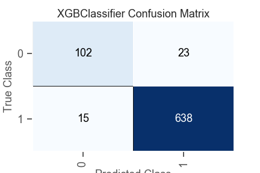
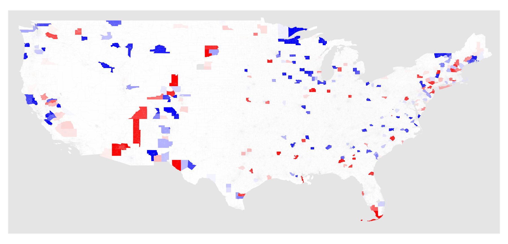
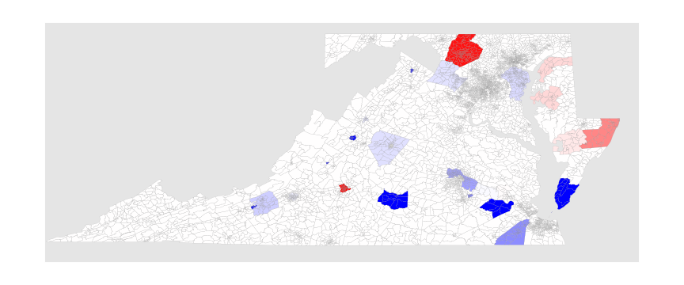
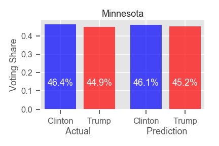
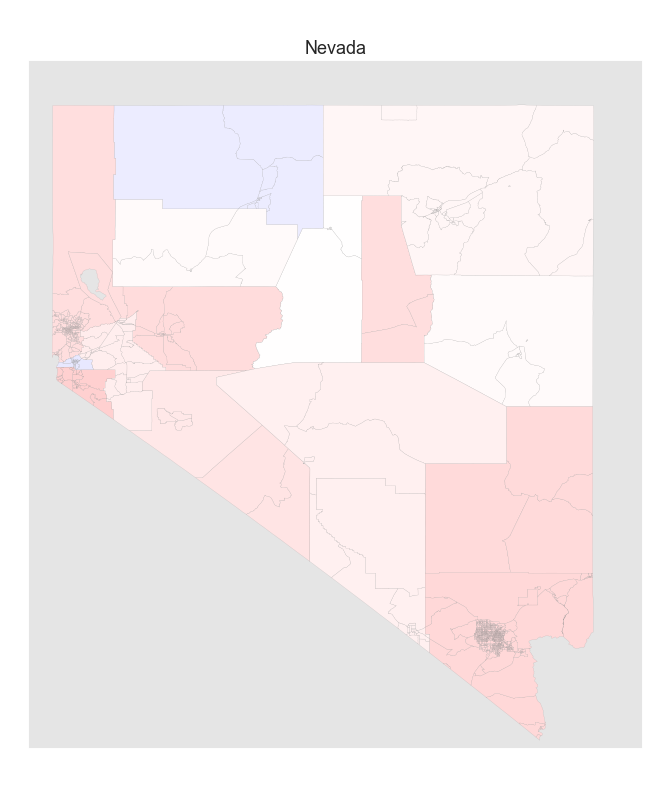

# 2016 Presidential Election Analysis

## Context

The people in the United States are not well united when it comes to politics. While having different opinions and expressing their ideas are important foundations of democracy, a widening social cleavage may undermine the functionalities of the government and communities. The presidential election in 2016 provided a clear picture of where bipartisanship of the nation stands today, and led to a lot of intriguing discussions. In this project, we tried to figure out how the social profiles of the population contributed to the voting results at the 2016 presidential election. In the end, we found that the division of profiles between counties that voted for Mr. Trump and those supported Mrs. Clinton was so substantial that any models could tell the difference clearly. Major determinant factors are represented by racial proportion of the population and urban/rural division.

## Contributors
Dmitry Mikhaylov and Keita Miyaki

## Questions
- Can social profile of countires tell 2016 election results?
- How much does social profile explain the results?
- What are the most important features?

## Datasets
- US Census: American Community Survey 5-Year Data

We used "Data Profile" table which offers more than 1,000 variables about broad social, economic, housing, and demographic information

- US Religion Census

We used 2010 data which was the latest

- MIT Election Data and Science Lab: "County Presidential Election Returns 2000-2016"

We used a dummy variable of Donald Trump winning in each county based on this dataset

## Data Cleaning
We filtered US Census ACS variables into 260 features, which are in percentage points (not actual population figures), available at county level, and without values larger than 100 or negative. We removed counties in Puerto Rico because census data format was unique. We also dropped Alaska because presidential election districts do not correspond to counties.

## Models
We used classifier models of Random Forest, Support Vector Machine, and XGBoost methods. In general, any model could capture the difference between counties that voted for the Republican candidate and those voted for the Democrat with test accuracy as high as 0.93-0.95. Most important features included racial proportion (e.g. white or Asian population) and degree of urbanization (e.g. means of transportation, multiple-unit housing.)

## Analysis

### County Level Classification

Firstly we look at county-level predictions. The questions included: whether or not basic social profiles of counties could determine the election results; if so, what the important features would be. I used US Census’s American Community Survey as the base data as well as the 2010 US Religion Census to add religious aspects of populations and applied some machine learning techniques.

### Prediction Results

Following the common practice, I split the 3,112 counties into 70% and 30% for training and test datasets respectively, and trained models with the former group. The test results did not vary much by models, and each model marked test scores above 92%. For example, XGBoost model predicted Mr. Trump winning in 661 counties of which 638, or 97%, were true, while the model got 87% right for counties and cities voted for Mrs. Clinton; the total accuracy of the model prediction in test set was as high as 95%. This result indicates that social profile of each county explains much of the voting tendency of its population and there is a wide gap between red and blue counties.

*Class 0: Ms. Clinton. Class 1: Mr. Trump. Source: US Census, author’s calculation*

### Determinant Features

The next question is about the determinants of results. It is not clear from the plain vanilla model, which is based on more than 150 features. Here we can use regularization techniques to reduce the number of features. By applying a strong L1 regularization factor we see less features used in a model. As the scatter chart indicates, extremely restricted models with 10 or fewer features still perform superbly.

*Source: US Census, author’s calculation*

The following box plots show top features in restricted models based on average importance scores

- Obviously the racial proportion of counties matters; counties which voted for Mr. Trump were distinctively more white than Mrs. Clinton’s counties, based on the second and fourth features; and fifth and sixth features tell an opposite trend about Asian populations in counties; while the difference in terms of African American population is not as critical, blue counties tend to have more African American population than red counties do
- The first feature represents the urban lifestyle of commuting by trains or busses, and cities are bluer than rural areas
- While the Jewish religion is minority in most counties, it explains some important part of the division between blue and red counties

*Source: US Census, author’s calculation*

### Model Errors

The model wrongly predicted 5% of the results, and those 5% concentrated in counties where the margins were relatively narrow. With 1,000 of random trials, I rarely found that models mispredict the results in counties where a candidate won with a 25% or wider margin.

*Source: US Census, author’s calculation*

In the following map, I indicated where the models oftentimes make mistakes. Dark blue means a high probability that models call for Mr. Trump but actually Mrs. Clinton won in the county and vice versa. While the fact that the errors are observed in certain counties indicates some biases from omitted factors, which could be county-specific information, the bias is small enough in the big picture.

*Blue: counties where models predicted red but Ms. Clinton won. Red: counties where model predicted blue but Mr. Trump won. Source: US Census and author’s calculation*

Here is a more detailed map of Washington D.C., Maryland, and Virginia. Some competitive counties in Virginia were difficult for the models; models always made mistakes in counties where Mrs. Clinton won with relatively narrow margins including Northampton (Mrs. Clinton 52.8% vs. Mr. Trump 43.5%), Prince Edward (C 50.2% vs. T 44.9%), Radford (C 48.1% vs. T 43.4%), Staunton (C 47.6% vs. T 45.6%), Surry (C 53.7% vs. T 43.0%), and Winchester (C 48.4% vs T 44.9%), while Lynchburg turned out to be red (C 41.5% vs. T 50.4%) despite the model predictions to be blue. In Maryland, Frederick county always confused the models (C 45.0% vs. T 47.4%).

*Blue: counties where models predicted red but Ms. Clinton won. Red: counties where model predicted blue but Mr. Trump won. Source: US Census and author’s calculation*

### County Level Regressions (Voting Share Margin Models)

From here, instead of classifiers, we examine models which predict margins of the voting results which are continuous numbers. Most machine learning models perform well again with R-squared slightly below 0.90. Here is a map of average test errors from 100 random trials. Counties in blue are where Mrs. Clinton perform better than the demography and social profiles of the counties tell, and vice versa for red. While the models are slightly biased and there may be omitted factors, features in the models capture the most static characteristics of each county (e.g. demography, lifestyle, religion) and omitted factors would be less structural (e.g. cyclical economic conditions varying by states).

*Blue: Mrs. Clinton gained more than models predicted. Red: Mr. Trump gained more than models predicted. Model: XGBoost. Source: US Census and author’s calculation*

### State Level Prediction 

Some states are competitive and others are less so; because of the winner-takes-all rule, predicting the state-level result is meaningful. Here I look at each of so-called “swing states” and compare the actual results and what the social profile data indicates.

#### Colorado

*Source: US Census and author’s calculation*

Mrs. Clinton took the state of Colorado with winning 48.2% of total votes, close to 48.0% that models predicted. Models predicted counties with larger populations very well, including Denver and Jefferson counties, while they underestimated Mr. Trump in El Paso (Colorado Springs) county (model margin 6.6% vs. actual 22.3%).

*Blue: Ms. Clinton gained more than models predicted. Red: Mr. Trump gained more than models predicted. Model: XGBoost. Source: US Census and author’s calculation*

#### Florida

*Source: US Census and author’s calculation*

Florida was one of the most competitive states in 2016, and Mr. Trump won with a margin of 1.2%. Models predicted it with an even narrower margin of 0.2%. Mrs. Clinton could not gain as much as models predicted in Miami-Dade (model margin 46.4% vs. actual 29.6%) and lost Pinellas and Duval (Jacksonville) counties despite the model predictions (model margins 5.7% and 13.5% for Mrs. Clinton respectively vs. actual 1.1% and 1.4% for Mr. Trump respectively).

*Blue: Ms. Clinton gained more than models predicted. Red: Mr. Trump gained more than models predicted. Model: XGBoost. Source: US Census and author’s calculation*

#### Iowa

*Source: US Census and author’s calculation*

Iowa could have been much less competitive based on the models. Mrs. Clinton performed well in most populated counties including Polk (Des Moines) and Linn (Cedar Rapids) counties (model margins 4.3% for Mrs. Clinton and 7.0% for Mr. Trump respectively vs. actual 11.3% and 1.5% both for Mrs. Clinton respectively).

*Blue: Ms. Clinton gained more than models predicted. Red: Mr. Trump gained more than models predicted. Model: XGBoost. Source: US Census and author’s calculation*

#### Michigan

*Source: US Census and author’s calculation*

Michigan was another most competitive state in 2016, while the models predicted a wider margin for Mr. Trump. Mrs. Clinton gained more than models predicted in the Southern part of the state, including Wayne (Detroit) and Oakland (model margins 24.4% for Mrs. Clinton and 3.6% for Mr. Trump respectively vs. actual 37.3% and 8.1% both for Mrs. Clinton respectively)

*Blue: Ms. Clinton gained more than models predicted. Red: Mr. Trump gained more than models predicted. Model: XGBoost. Source: US Census and author’s calculation*

#### Minnesota

*Source: US Census and author’s calculation*

Models predicted results as competitive as the actual result in Minnesota. Mrs. Clinton gained slightly more than model predictions in major three counties including Dakota which Model called Mr. Trump’s victory (model margins 2.5% for Mr. Trump vs. actual 4.7% for Mrs. Clinton)

*Blue: Ms. Clinton gained more than models predicted. Red: Mr. Trump gained more than models predicted. Model: XGBoost. Source: US Census and author’s calculation*

#### Ohio

*Source: US Census and author’s calculation*

Models predicted Ohio well, while Mrs. Clinton gained more than the prediction in Cuyahoga (Cleveland) and Franklin (Columbus) counties (model margins 25.6% and 17.3% respectively vs. actual 35.4% 26.1% respectively)

*Blue: Ms. Clinton gained more than models predicted. Red: Mr. Trump gained more than models predicted. Model: XGBoost. Source: US Census and author’s calculation*

#### Nevada

*Source: US Census and author’s calculation*

Nevada could have been an easier state for Mrs. Clinton based on the models. Mr. Trump closed the rival impressively in Clark (Las Vegas) and Washoe (Reno) both blue counties (model margins 26.3% and 13.8% vs. actual 10.7% and 1.2%).

*Blue: Ms. Clinton gained more than models predicted. Red: Mr. Trump gained more than models predicted. Model: XGBoost. Source: US Census and author’s calculation*

#### New Hampshire

*Source: US Census and author’s calculation*

New Hampshire was slightly more competitive as the prediction. In two of the largest counties of Hillsborough and Rockingham counties, Mr. Trump gained more than model predictions (model margins 0.8% for Mrs. Clinton and 2.6% for Mr. Trump respectively vs. actual 0.2% and 5.8% both for Mr. Trump respectively)

*Blue: Ms. Clinton gained more than models predicted. Red: Mr. Trump gained more than models predicted. Model: XGBoost. Source: US Census and author’s calculation*

#### North Carolina

*Source: US Census and author’s calculation*

Mrs. Clinton performed better than model prediction in North Carolina. In three of the largest counties of Wake (Raleigh), Mecklenburg(Charlotte), and Guilford (Greensboro) she widened the margins (model margins 4.2%, 25.0%, 13.1% respectively vs. actual 20.2%, 29.4%, 19.9%).

*Blue: Ms. Clinton gained more than models predicted. Red: Mr. Trump gained more than models predicted. Model: XGBoost. Source: US Census and author’s calculation*

#### Pennsylvania

*Source: US Census and author’s calculation*

Models predicted a more competitive race in Pennsylvania than actual. While Mrs. Clinton gained a wider margin than predicted in Philadelphia (model margin 55.1% vs. actual 67.1%), smaller counties provided more support for Mr. Trump than predicted.

*Blue: Ms. Clinton gained more than models predicted. Red: Mr. Trump gained more than models predicted. Model: XGBoost. Source: US Census and author’s calculation*

#### Virginia

*Source: US Census and author’s calculation*

Virginia was painted bluer than the model predicted, as discussed in the classification model error section. Mrs. Clinton widened the lead in medium-sized counties such as Henrico and Arlington counties (model margins 4.9% and 45.9% respectively vs. 20.8% and 59.2% respectively) while she gained in some red counties, including Chesterfield and Chesapeake counties (model margin 16.8% and 10.8% for Mr. Trump respectively vs. actual 2.3% and 1.3% respectively).

*Blue: Ms. Clinton gained more than models predicted. Red: Mr. Trump gained more than models predicted. Model: XGBoost. Source: US Census and author’s calculation*

#### Wisconsin

*Source: US Census and author’s calculation*

Wisconsin was another state where the actual result was tighter than model predictions. Mrs. Clinton widen the lead in Milwaukee city and Dane (Madison) county (model margin 30.1% and 40.2% respectively vs. actual 37.0% and 47.2% respectively)

*Blue: Ms. Clinton gained more than models predicted. Red: Mr. Trump gained more than models predicted. Model: XGBoost. Source: US Census and author’s calculation*

### Implications for 2020 Election

It is a long shot to predict the results of 2020 presidential election from the models based on 2016 data. The models here are, however, based on fundamental characteristics of counties, and may provide some structural implications.

For the Democrat candidate to win the 2020 presidential race, s/he will need to add at least 38 electoral votes (EVs) to 232 EVs that Mrs. Clinton won in 2016. Without Florida’s 29 EVs, it would be difficult for Democrats to beat the counterpart. Based on the demographic and social profile, Arizona could provide 11EVs for democrats, while the state has been red for past five presidential elections. If not Arizona, Pennsylvania’s 20 EVs would suffice together with Florida.

For the Republican candidate, keeping Florida and Pennsylvania red is critical. Michigan’s and Wisconsin’s 16 and 10 EVs respectively seem to be slightly more secured than the competitive 2016 result indicated.

*Source: US Census and author’s calculation*
