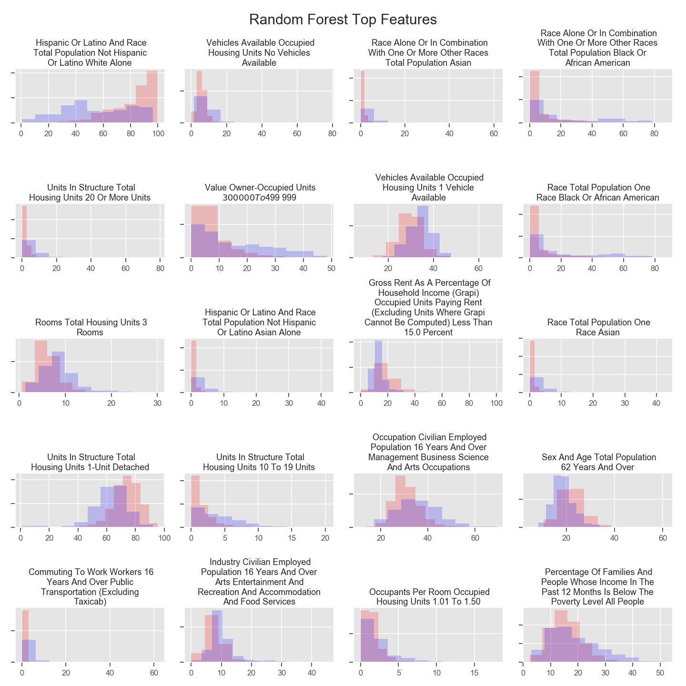
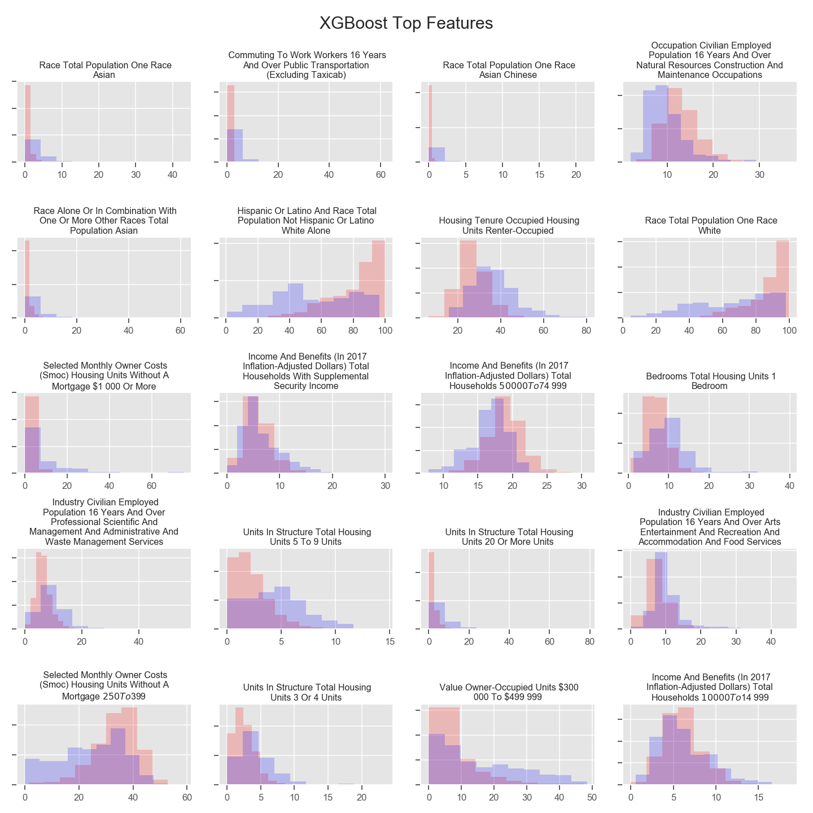

# 2016 Presidential Election Analysis

## Contributors
Dmitry Mikhaylov and Keita Miyaki

## Questions
- Can social profile of countires tell 2016 election results?
- How much does social profile explain the results?
- What are the most important features?

## Datasets
- US Census: American Community Survey 5-Year Data
-- We used "Data Profile" table which offers more than 1,000 variables about broad social, economic, housing, and demographic information. 
- MIT Election Data and Science Lab: "County Presidential Election Returns 2000-2016"
-- We used a dummy variable of Donald Trump winning in each county based on this dataset

## Data Cleaning
We filtered US Census ACS variables into 260 features, which are in percentage points (not actual population figures), available at county level, and without values larger than 100 or negative. We removed counties in Puerto Rico because census data format was unique. We also dropped Alaska because presidential election districts do not correspond to counties.

## Analysis
We used classifier models of Random Forest, Support Vector Machine, and XGBoost methods. In general, any model could capture the difference between counties that voted for the Republican candidate and those voted for the Democrat with test accuracy as high as 0.93-0.95. Most important features included racial proportion (e.g. white or Asian population) and degree of urbanization (e.g. means of transportation, multiple-unit housing.)

